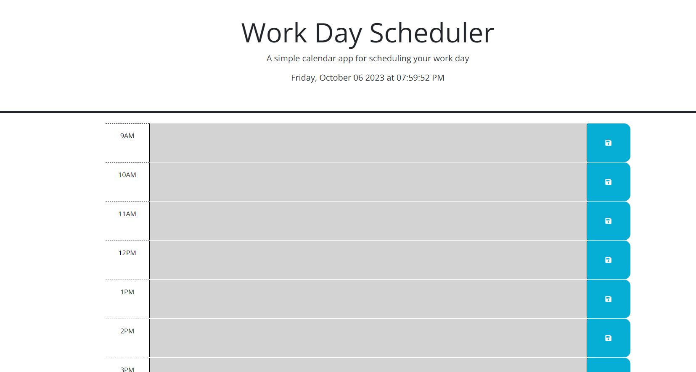
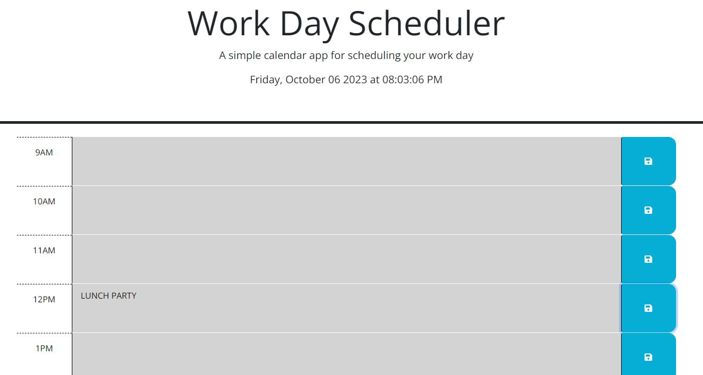
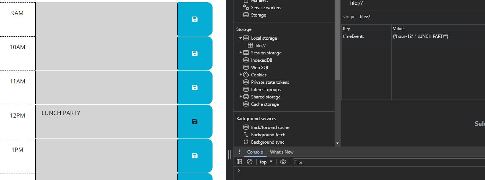

# MyTimeScheduler

## Description

```
This application works and explores third-APIs like Bootstrap, jQuery, and Dayjs lending itself simpler ways to engage functionality in our code. To showcase, the appication is event scheduler for a 9 - 5 worker. It calls up the current day and loads any saved events in the scheduler and also allow changes and additional input from the worker, saving its progress in local storage. The scheduler also dynamically moves according to the current hour visually using color cues for timeblocks in the past, present, and future.

- As the user loads the scheduler, it calls on any local data stored and produce the saved events of the day. The current time is displayed and timeblock visually adjusts according to the current hour. The user can input text in the timeblocks and save the event by clicking the save icon of that adjacent time block.
```

## Screenshots




## Link

[live web application](https://fractalicecream.github.io/MyTimeScheduler/)

## User Story

```
AS AN employee with a busy schedule
I WANT to add important events to a daily planner
SO THAT I can manage my time effectively
```

## Acceptance Criteria

```
GIVEN I am using a daily planner to create a schedule
WHEN I open the planner
THEN the current day is displayed at the top of the calendar
WHEN I scroll down
THEN I am presented with timeblocks for standard business hours of 9am&ndash;5pm
WHEN I view the timeblocks for that day
THEN each timeblock is color coded to indicate whether it is in the past, present, or future
WHEN I click into a timeblock
THEN I can enter an event
WHEN I click the save button for that timeblock
THEN the text for that event is saved in local storage
WHEN I refresh the page
THEN the saved events persist
```